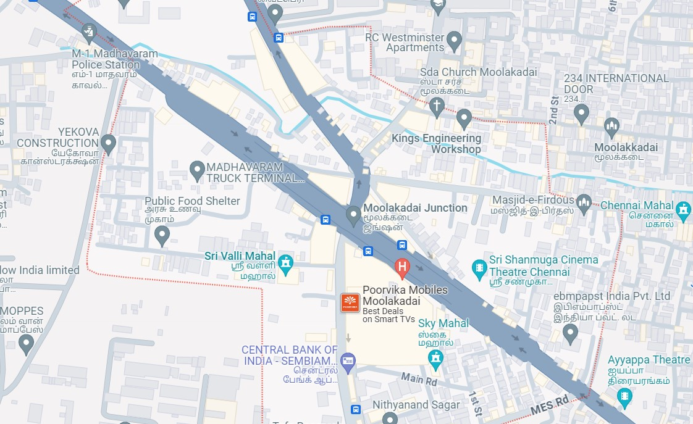

# Places Around Me
# Aim:
To develop a website to display details about the places around my house.

# Design Steps:
## Step 1
Create a new django project and app
## Step 2
Add a new imagemap html file in templates and neede images in static folder and define it in settings.
## Step 3
Type ur image map code in the html with coordinates and target file to redirect on click
## Step 4
Define your components pages and create content in such a way that it gives information about place which is being clicked
## Step 5
Include pictures and contents for your subpages and map them using urls and views
# Code:
```
map.html
<!DOCTYPE html>
<html lang="en">
<head>
    <meta charset="UTF-8">
    <meta name="viewport" content="width=device-width, initial-scale=1.0">
    <title>Document</title>
</head>
<body>
    <h1>IMAGE MAPS DEMO</h1>
    
    <map name="image_map">
        <area alt="Poorvika Mobiles" title="Poorvika Mobiles" href="poorvika.html" coords="561,408,748,509" shape="rect">
        <area alt="Kings Engineering Workshop" title="Kings Engineering Workshop" href="workshop.html" coords="619,170,825,287" shape="rect">
        <area alt="Public Food Shelter" title="Public Food Shelter" href="food.html" coords="218,286,402,414" shape="rect">
        <area alt="Madhavaram Police station" title="Madhavaram Police station" href="police.html" coords="95,51,276,166" shape="rect">
        <area alt="Chennai Mahal" title="Chennai Mahal" href="mahal.html" coords="964,293,1116,388" shape="rect">
    </map>

    
</body>
</html>

food.html
<!DOCTYPE html>
<html lang="en">
<head>
    <meta charset="UTF-8">
    <meta name="viewport" content="width=device-width, initial-scale=1.0">
    <title>Public food shelter</title>
</head>
<body>
    <p>
    A public food shelter is a place where individuals in need can access food assistance and support. These shelters often operate with the goal of addressing food insecurity within communities by providing meals or groceries to those facing economic challenges.
    </p>
</body>
</html>

mahal.html
<!DOCTYPE html>
<html lang="en">
<head>
    <meta charset="UTF-8">
    <meta name="viewport" content="width=device-width, initial-scale=1.0">
    <title>Chennai mahal</title>
</head>
<body>
    <p>
        A marriage hall, also known as a wedding venue or banquet hall, is a dedicated space designed for hosting wedding ceremonies and related events. These halls provide a venue for couples to celebrate their marriage with family and friends, offering facilities for ceremonies, receptions, and other festivities associated with weddings.
    </p>
    
</body>
</html>

police.html
<!DOCTYPE html>
<html lang="en">
<head>
    <meta charset="UTF-8">
    <meta name="viewport" content="width=device-width, initial-scale=1.0">
    <title>Police station</title>
</head>
<body>
    <p>
        A police station is a facility where law enforcement officers work to maintain public safety, investigate crimes, and provide various services to the community. It serves as a central location for police operations, including reporting crimes, seeking assistance, and conducting official business related to law enforcement.
    </p>
</body>
</html>

poorvika.html
<!DOCTYPE html>
<html lang="en">
<head>
    <meta charset="UTF-8">
    <meta name="viewport" content="width=device-width, initial-scale=1.0">
    <title>Poorvika mobiles</title>
</head>
<body>
    <p>
        A mobile shop typically refers to a retail store or business that sells mobile phones, accessories, and related products. Customers can visit these shops to purchase new phones, get accessories, or seek assistance with mobile device-related services such as repairs or upgrades.
    </p>
</body>
</html>

workshop.html
<!DOCTYPE html>
<html lang="en">
<head>
    <meta charset="UTF-8">
    <meta name="viewport" content="width=device-width, initial-scale=1.0">
    <title>Workshop</title>
</head>
<body>
    <p>
    An Engineering workshop is a facility equipped for various engineering activities, such as prototyping, manufacturing, and repair. It provides a space for engineers and technicians to design, build, and modify mechanical or electronic components, conduct experiments, and perform hands-on work related to different branches of engineering.
    </p>
</body>
</html>
```

# Output:

# Result:
The program for implementing image map is executed successfully.
